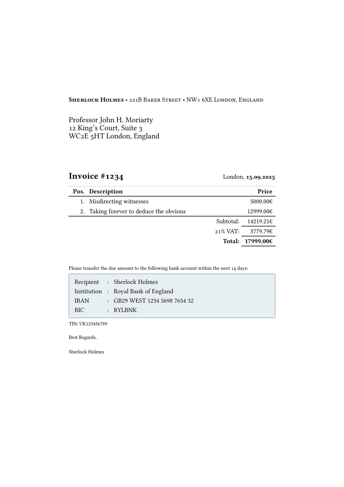

# Pekmez Invoice

Minimalistic CLI friendly invoice generator



Tried to get the looks from the projects in the <a href="#thanks">thanks</a> section.
Removed the complexity I didn't understand myself and added support to call it
from CLI.

## Usage

You need to have a configuration file

### Configuration

Put the config file somewhere, by default it will be read from
`$XDG_CONFIG_HOME/invoice/details.yaml`, `$XDG_CONFIG_HOME` depends on the
system, but usually `~/.config`.

See [example config file](./src/details.yaml)

### Run

Current possible ways to run is below;

#### Nix

Straightforward to run with [Nix](https://nixos.org/)

```bash
nix run github:Deliganli/pekmez-invoice -- \
    --invoice-date 15.09.2025 \
    --invoice-number 1234 \
    --items '[{"description":"Misdirecting witnesses", "price":5000 }, {"description":"Taking forever to deduce the obvious", "price":12999 }]' \
    --output myinvoice.pdf
```

#### Docker

A bit more args with docker

```bash
docker run \
    -u $(id -u):$(id -g) \
    -v "$HOME/.config/invoice:/.config/invoice:ro" \
    -v './:/app/out/' \
    ghcr.io/deliganli/pekmez-invoice \
    --invoice-date 15.09.2025 \
    --invoice-number 1234 \
    --items '[{"description":"Misdirecting witnesses", "price":5000 }, {"description":"Taking forever to deduce the obvious", "price":12999 }]' \
    --output out/myinvoice.pdf
```

Find the `myinvoice.pdf` in the directory you run this command

### Thanks

<a name="thanks"></a>
Inspired and straight out copied code from below projects

- [tiefletter](https://github.com/Tiefseetauchner/TiefLetter): nice and minimalistic invoice template
- [typst-invoice](https://github.com/erictapen/typst-invoice): minimalistic German invoice template
- [invoice-boilerplate](https://github.com/mrzool/invoice-boilerplate/): simplest yet best looking invoice template
